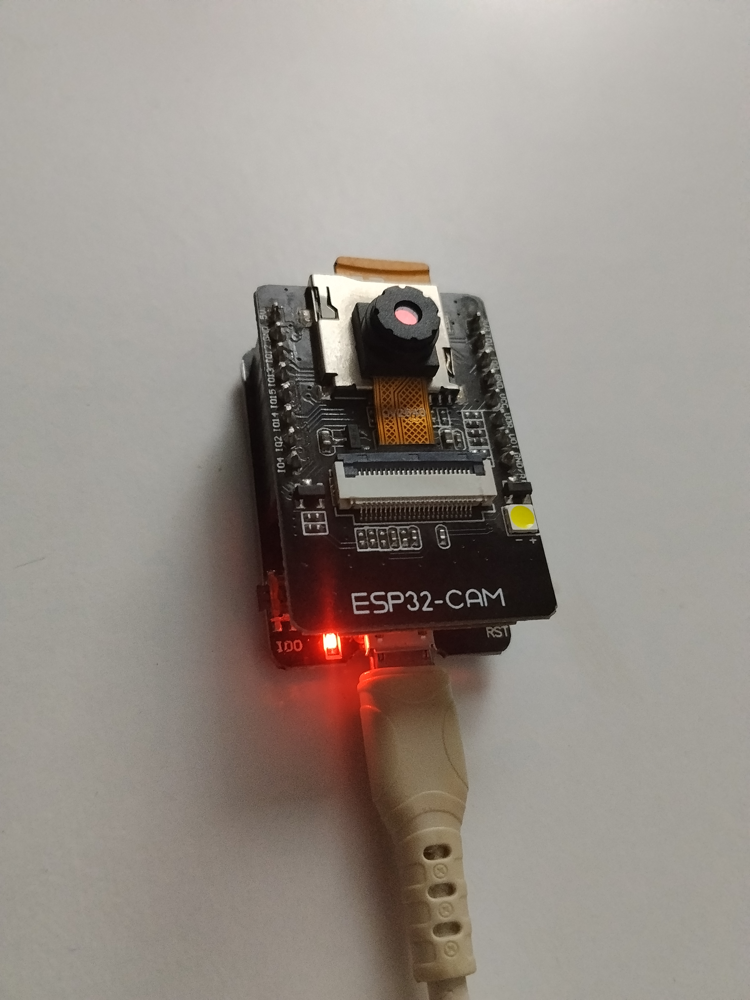
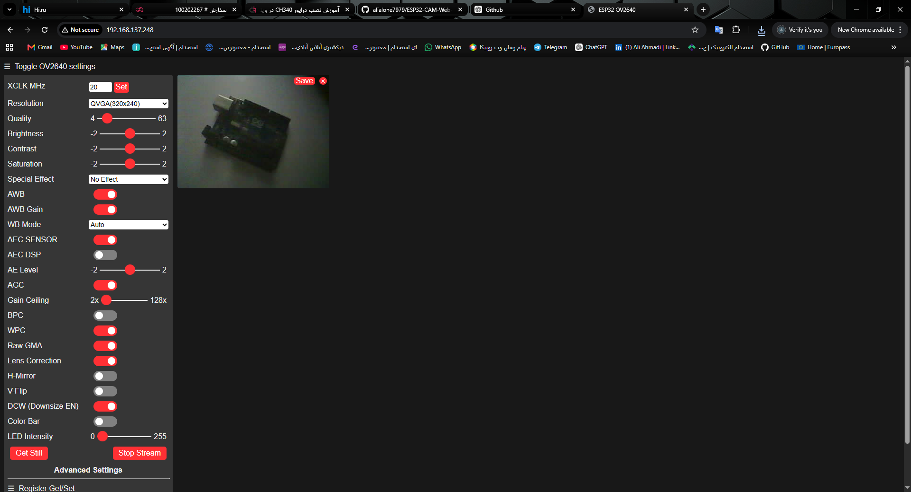
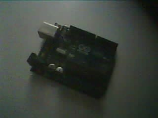

# ESP32-CAM Web Server

A practical ESP32-CAM project based on the CameraWebServer example, configured for the AI-Thinker ESP32-CAM board.

The project provides a web-based interface for accessing the ESP32-CAM and viewing images captured by the camera over a Wi-Fi network.

## Project Overview

This project demonstrates the basic setup and operation of an AI-Thinker ESP32-CAM with a web server.

The ESP32-CAM connects to a Wi-Fi network and hosts a web interface that can be accessed from a browser. The interface provides camera controls and allows images captured by the ESP32-CAM to be viewed remotely.

The project was used to configure, program, and test the ESP32-CAM hardware with a programmer shield.

## Hardware

- ESP32-CAM AI-Thinker
- ESP32-CAM Programmer Shield
- USB connection for programming
- Wi-Fi network

## Features

- ESP32-CAM configuration for the AI-Thinker board
- Wi-Fi connectivity
- Web-based camera interface
- Remote camera control through a browser
- Image capture and viewing
- Practical hardware testing

## Hardware Setup

The ESP32-CAM is mounted on a programmer shield for programming and testing.



## Web Interface

After connecting to the Wi-Fi network, the ESP32-CAM provides a web interface that can be accessed through a browser.



## Camera Output

The following image was captured using the ESP32-CAM.



## Demo

A demonstration of the ESP32-CAM Web Server running on the actual hardware is available below.

**Demo video:**

`ESP32-CAM-Web-Server-Demo.mp4`

## Software

- Arduino IDE
- ESP32 Arduino Core
- AI-Thinker ESP32-CAM
- CameraWebServer example

## Camera Configuration

The project is configured for the AI-Thinker ESP32-CAM board.

```cpp
#define CAMERA_MODEL_AI_THINKER
```

## Project Structure

```text
ESP32-CAM-Web-Server/
│
├── ESP32-CAM-Web-Server.ino
├── app_httpd.cpp
├── camera_index.h
├── camera_pins.h
├── ci.json
│
├── ESP32-CAM-Web-Server-Hardware.jpg
├── ESP32-CAM-Web-Server-Interface.png
├── ESP32-CAM-Web-Server-Capture.jpg
├── ESP32-CAM-Web-Server-Demo.mp4
│
└── README.md
```

## Note

This project is based on the ESP32 `CameraWebServer` example and was configured for the AI-Thinker ESP32-CAM hardware.

The main purpose of this repository is to document the hardware setup, board configuration, programming process, and practical testing of the ESP32-CAM.

## Author

**Ali Ahmadi**

GitHub: [@alialone7979](https://github.com/alialone7979)
